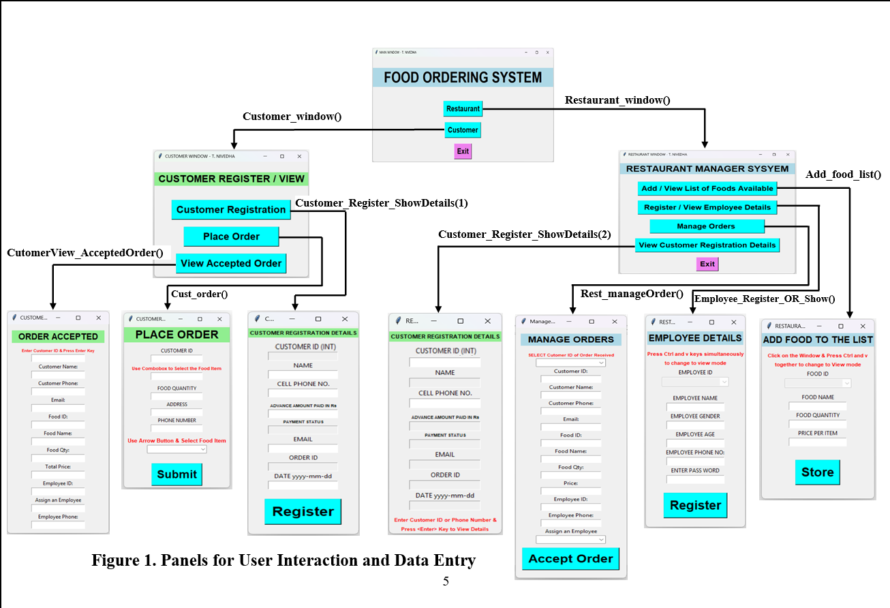
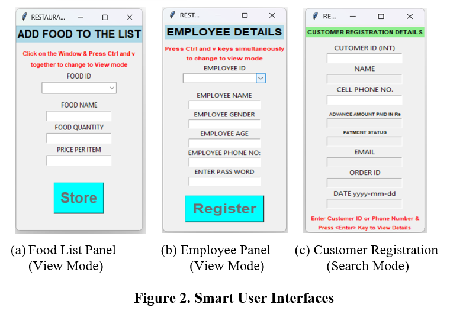
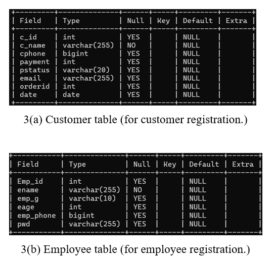
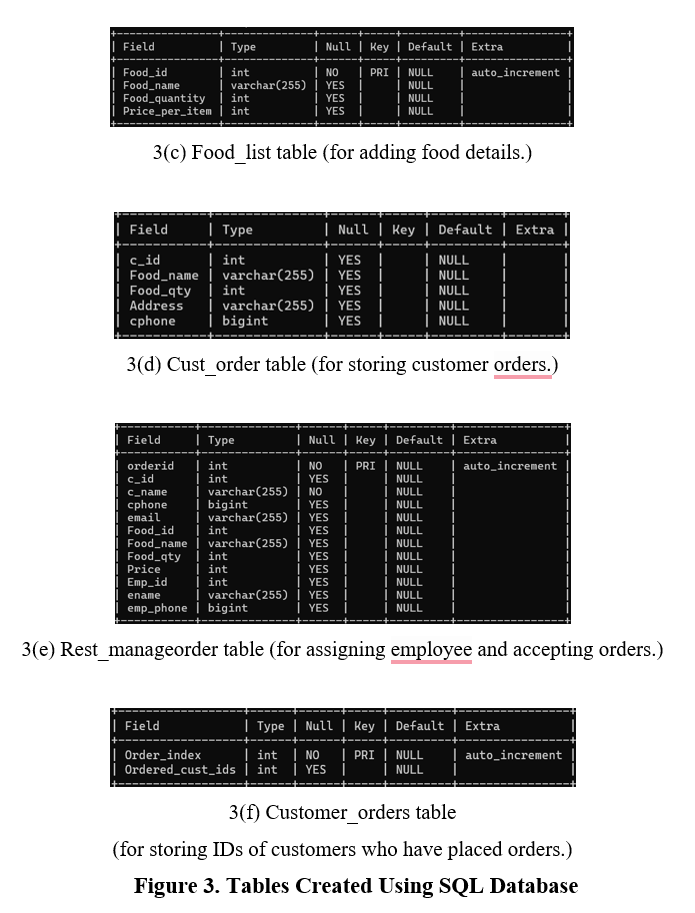
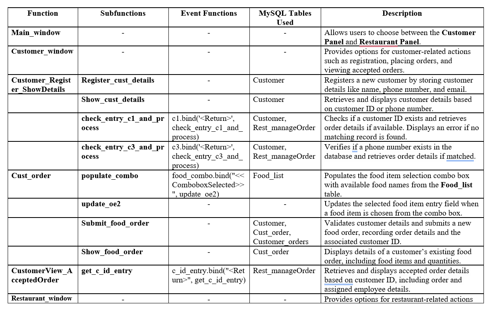
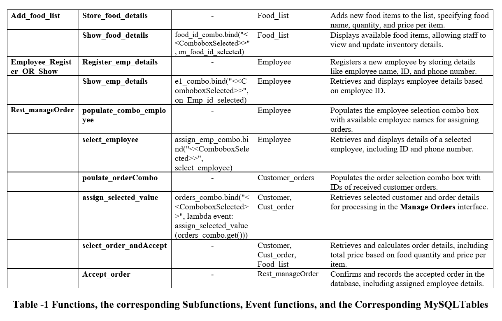

<h1 align="center">
FOOD ORDERING AND MANAGEMENT SYSTEM WITH SMART USER INTERFACES AND ORDER TRACKING
</h1>
<p align="center">
(Class 12 Project)
</p>

<p align="center">
  
  
  
  
  
  
</p>

## Description

This is a Python-based Food Ordering System using Tkinter for GUI and MySQL Server for database management.

## Project Report

[Download Project Report](T_Nivedha_XII_B_2024_25.pdf)

## Features

* Customer Registration
* Place Food Orders
* Restaurant Manager System
* Employee Management
* Order Tracking

## Technologies Used

* Python
* Tkinter (GUI)
* MySQL

## How to Run

1. Install MySQL Server
2. Install required package:

   ```
   pip install mysql-connector-python
   ```
3. Update MySQL password in code
4. Run:

   ```
   python food_order_system.py
   ```

## Database

Database and tables are automatically created when the program runs.

## Screenshots

### User Interaction and Data Entry


### Smart User Interface


### Database Design (Customer Table)


### Database Design (Order Table)


### Manager View (Orders)


### Manager View (Employees)


## Author

T. Nivedha
